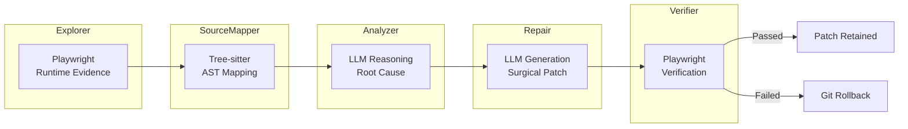
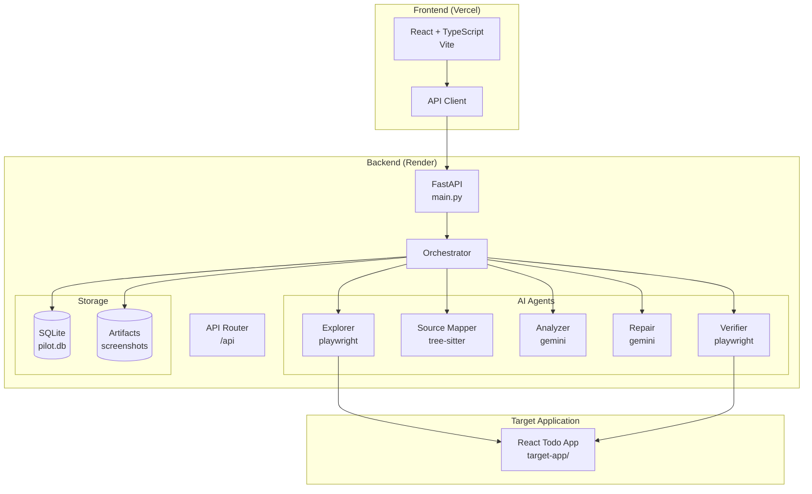
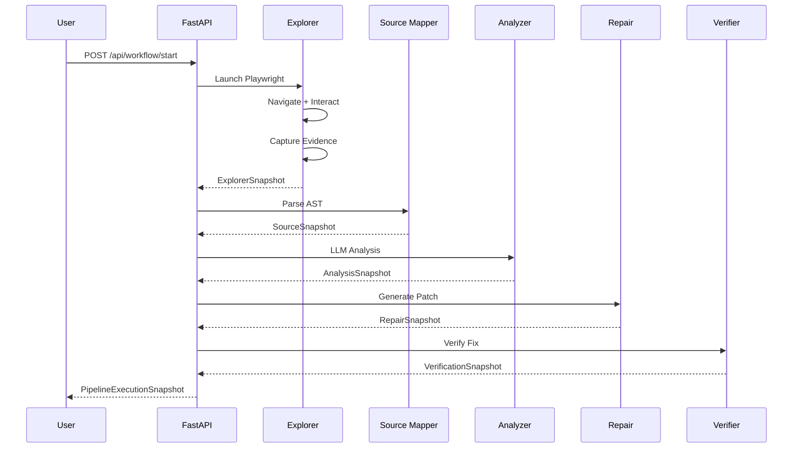

<div align="center">

# FrontendPilot AI

### Autonomous Quality Engineering Agent

[](https://fastapi.tiangolo.com)
[](https://python.org)
[](https://ai.google.dev)
[](https://playwright.dev)
[](https://frontend-pilot-ai.vercel.app)
[](https://frontendpilot-ai-api.onrender.com)

</div>

---

## Live Links

| Resource              | Link                                                                                                       |
| --------------------- | ---------------------------------------------------------------------------------------------------------- |
| **Live Demo**         | [https://frontend-pilot-ai.vercel.app/](https://frontend-pilot-ai.vercel.app/)                             |
| **Backend API**       | [https://frontendpilot-ai-api.onrender.com](https://frontendpilot-ai-api.onrender.com)                     |
| **API Docs**          | [https://frontendpilot-ai-api.onrender.com/docs](https://frontendpilot-ai-api.onrender.com/docs)           |
| **GitHub Repository** | [https://github.com/irrshad7-droid/Frontend-Pilot-AI](https://github.com/irrshad7-droid/Frontend-Pilot-AI) |

---

## Problem

Frontend debugging is fragmented. Developers switch between:

- **Browser DevTools** — for DOM inspection and console errors
- **Log aggregators** — for runtime traces and network failures
- **AI assistants** — for code suggestions and explanations
- **Source code** — to understand and fix the actual bug

This context-switching wastes hours. When a UI bug appears, developers must manually correlate runtime behavior with source code, formulate hypotheses, and craft patches — all while hoping they don't introduce regressions.

---

## Solution

FrontendPilot AI unifies the entire debugging workflow into a single autonomous loop:



**The pipeline:**

1. **Explorer** — Launches the target app in Playwright, captures runtime evidence (DOM, console, network, screenshots)
2. **Source Mapper** — Uses Tree-sitter AST to map runtime failures to specific source code locations
3. **Analyzer** — Employs LLM reasoning to identify root cause and generate repair context
4. **Repair** — Synthesizes surgical search/replace patches with LLM assistance
5. **Verifier** — Re-runs the target app to validate the fix without regressions
6. **Mission Control** — Presents the complete investigation with visual evidence

---

## Features

| Feature                       | Description                                                 | Status         |
| ----------------------------- | ----------------------------------------------------------- | -------------- |
| **Autonomous Pipeline**       | End-to-end bug detection to fix without human intervention  | ✅ Implemented |
| **Runtime Evidence Capture**  | DOM snapshots, console logs, network failures, screenshots  | ✅ Implemented |
| **AST-based Source Mapping**  | Tree-sitter parses TypeScript/JSX to locate bug sources     | ✅ Implemented |
| **LLM Root Cause Analysis**   | Competing hypotheses with confidence scoring                | ✅ Implemented |
| **Surgical Patch Generation** | Search/replace diffs with syntax validation                 | ✅ Implemented |
| **Automated Verification**    | Playwright re-runs to confirm fix, auto-rollback on failure | ✅ Implemented |
| **Live Dashboard**            | Real-time pipeline visualization with stage inspectors      | ✅ Implemented |
| **Swagger/OpenAPI Docs**      | Interactive API documentation                               | ✅ Implemented |

---

## Architecture



---

## AI Workflow



---

## Screenshots

> Screenshots are placeholders. Replace with actual images in `docs/images/`

| Landing                             | Explorer                              | Analyzer                              |
| ----------------------------------- | ------------------------------------- | ------------------------------------- |
|  |  |  |

| Repair                            | Verification                                  | Mission Control                                     |
| --------------------------------- | --------------------------------------------- | --------------------------------------------------- |
|  |  |  |

---

## Technology Stack

| Layer          | Technology                            |
| -------------- | ------------------------------------- |
| **Frontend**   | React, TypeScript, Vite, Tailwind CSS |
| **Backend**    | FastAPI, Python 3.10, Uvicorn         |
| **AI**         | Google Gemini 2.5 Flash               |
| **Automation** | Playwright, Tree-sitter, GitPython    |
| **Deployment** | Vercel (Frontend), Render (Backend)   |

---

## Folder Structure

```
Frontend-Pilot-AI/
├── backend/                    # Python backend
│   ├── main.py                 # FastAPI entry point
│   ├── orchestrator.py         # Pipeline coordinator
│   ├── database.py             # SQLite initialization
│   ├── requirements.txt        # Python dependencies
│   ├── runtime.txt             # Python 3.10.13
│   ├── render.yaml             # Render deployment config
│   ├── .env.example            # Environment variables
│   ├── api/
│   │   └── routes.py           # /api/workflow/* endpoints
│   ├── agents/
│   │   ├── explorer.py         # Playwright runtime capture
│   │   ├── analyzer.py         # LLM root cause analysis
│   │   ├── repair.py           # Patch generation
│   │   └── verifier.py         # Fix verification
│   ├── core/
│   │   ├── schemas.py          # Pydantic models
│   │   └── source_mapper.py    # Tree-sitter AST mapping
│   └── artifacts/              # Screenshots, pipeline output
├── frontend/                   # React frontend
│   ├── src/
│   │   ├── api/pipeline.ts     # API client
│   │   ├── features/
│   │   │   ├── landing/        # Landing page
│   │   │   └── run/            # Live run dashboard
│   │   └── components/
│   │       ├── chrome/         # AppShell, StageRail, TopBar
│   │       └── run/            # Stage visualizers
│   └── package.json
├── target-app/                 # Target application to debug
│   └── src/
└── docs/
    ├── README.md
    ├── architecture/
    └── handoffs/
```

---

## Installation

### Prerequisites

- Python 3.10+
- Node.js 18+
- Google Gemini API key

### Backend

```bash
cd backend
python -m venv venv
source venv/bin/activate  # On Windows: venv\Scripts\activate
pip install -r requirements.txt
PLAYWRIGHT_BROWSERS_PATH=0 playwright install chromium
```

> **Note:** For Render deployment, `PLAYWRIGHT_BROWSERS_PATH=0` installs browsers in the application directory.

### Frontend

```bash
cd frontend
npm install
```

### Environment Variables

Create `backend/.env`:

```bash
# Required
GOOGLE_API_KEY=your-gemini-api-key

# Optional
LLM_PROVIDER=gemini
LLM_MODEL=gemini-3.5-flash
TARGET_APP_URL=http://localhost:5173
CORS_ORIGINS=http://localhost:5173,http://localhost:4173,https://frontend-pilot-ai.vercel.app
```

### Running Locally

```bash
# Terminal 1: Start target app
cd target-app
npm install && npm run dev

# Terminal 2: Start backend
cd backend
source venv/bin/activate
uvicorn main:app --host 0.0.0.0 --port 8000

# Terminal 3: Start frontend
cd frontend
npm run dev
```

---

## Deployment

### Frontend → Vercel

1. Connect repository to Vercel
2. Set environment variable:
   - `VITE_API_BASE_URL` = `https://your-backend.onrender.com/api`
3. Deploy

### Backend → Render

Using `render.yaml` (recommended):

```yaml
services:
  - type: web
    name: frontendpilot-ai-api
    runtime: python
    region: ohio
    plan: free
    buildCommand: pip install -r requirements.txt && pip install playwright && PLAYWRIGHT_BROWSERS_PATH=0 playwright install chromium --with-deps
    startCommand: uvicorn main:app --host 0.0.0.0 --port $PORT
    rootDir: backend
    envVars:
      - key: PYTHON_VERSION
        value: 3.10.13
      - key: PLAYWRIGHT_BROWSERS_PATH
        value: 0
      - key: LLM_PROVIDER
        value: gemini
      - key: GOOGLE_API_KEY
        sync: false
      - key: LLM_MODEL
        value: gemini-3.5-flash
      - key: TARGET_APP_URL
        sync: false
      - key: CORS_ORIGINS
        sync: false
```

Or manual configuration:

| Setting            | Value                                                                                                                             |
| ------------------ | --------------------------------------------------------------------------------------------------------------------------------- |
| **Root Directory** | `backend`                                                                                                                         |
| **Build Command**  | `pip install -r requirements.txt && pip install playwright && PLAYWRIGHT_BROWSERS_PATH=0 playwright install chromium --with-deps` |
| **Start Command**  | `uvicorn main:app --host 0.0.0.0 --port $PORT`                                                                                    |
| **Python Version** | `3.10.13`                                                                                                                         |

**Required Environment Variables on Render:**

| Variable         | Description                     |
| ---------------- | ------------------------------- |
| `GOOGLE_API_KEY` | Your Google Gemini API key      |
| `TARGET_APP_URL` | URL of the deployed target app  |
| `CORS_ORIGINS`   | Comma-separated allowed origins |

---

## Challenges

### 1. Playwright on Render

Playwright requires browser binaries. The build command `PLAYWRIGHT_BROWSERS_PATH=0 playwright install chromium --with-deps` installs browsers in the application directory and handles system dependencies.

### 2. Tree-sitter AST Parsing

Mapping runtime DOM elements to source code required custom Tree-sitter queries to identify JSX elements, their parent components, and line numbers.

### 3. LLM Structured Output

Using Google Gemini's `response_schema` with Pydantic models ensures type-safe patch generation, but requires careful prompt engineering to avoid markdown formatting in diffs.

### 4. Git Rollback Safety

The repair agent uses GitPython for atomic rollbacks when patches fail validation, ensuring the target app never remains in a broken state.

### 5. CORS for Local Development

The backend must allow both localhost (for development) and Vercel (for production) origins, configurable via `CORS_ORIGINS` environment variable.

---

## Future Roadmap

- [ ] Support for multiple target frameworks (Vue, Angular, Svelte)
- [ ] GitHub PR auto-generation with patch diffs
- [ ] Historical run comparison and regression detection
- [ ] Custom test scenario configuration
- [ ] Multi-browser verification (Firefox, WebKit)
- [ ] Performance metrics collection

---

## License

MIT License — see [LICENSE](LICENSE) for details.
