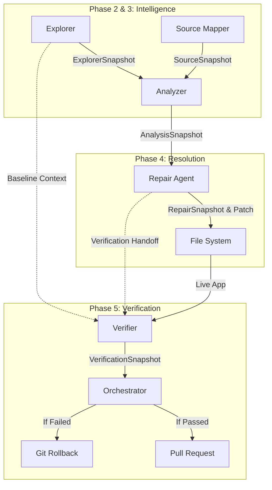

# FrontendPilot AI — Phase 5A: Verifier Architecture Specification

## 1. Verifier Architecture

The Verifier is the final autonomous gatekeeper. It is a strict validation layer responsible for confirming that a repair successfully resolved the bug without introducing regressions.

**Inputs:**
*   `ExplorerSnapshot`: Used as a baseline to understand the pre-patch state (e.g., initial screenshots, original console errors).
*   `RepairSnapshot`: Specifically the `verification_handoff` containing `verification_steps` and the `expected_outcome`.
*   The dynamically running, patched target application.

**Core Philosophy:**
The Verifier acts as a deterministic automated QA tester. It drives the browser according to a rigid list of structured Playwright actions provided by the Repair Agent (e.g., `{"action": "click", "selector": "button"}`). It compares the post-patch runtime state (DOM changes, visual screenshots, console logs) against the `expected_outcome`.

**Constraints:**
The Verifier is strictly prohibited from calling an LLM, generating source code, parsing ASTs, or diagnosing why a failure occurred. It only answers a boolean question: *Did the repair work?*

---

## 2. VerificationSnapshot Specification

The Verifier outputs a highly structured snapshot summarizing its test execution and final verdict.

```json
{
  "verification_status": "Passed | Failed | Inconclusive",
  "executed_steps": [
    {"action":"click", "selector":"button[data-testid='clear-completed']"},
    {"action":"assert_text", "selector":"#counter", "expected":"0 items left"}
  ],
  "observed_results": {
    "dom_state": "The Todo list element is empty.",
    "console_events": [],
    "network_failures": []
  },
  "regressions_detected": [
    "New console error introduced"
  ],
  "screenshot_before": "/path/to/artifacts/verify_before.png",
  "screenshot_after": "/path/to/artifacts/verify_after.png",
  "pass_fail_reason": "The 'Clear completed' button successfully removed the items from the DOM and updated active count to 0, matching the expected outcome.",
  "rollback_required": false
}
```

---

## 3. Pipeline Diagram



---

## 4. Failure Handling

The Verifier must handle runtime flakiness to prevent false negatives.
*   **Playwright Timeouts**: If a button cannot be found, the Verifier captures a screenshot, logs a `Failed` status, and triggers a rollback. It does not attempt to debug the timeout.
*   **New Console Errors**: If the repair fixed the UI but introduced a new JavaScript exception (e.g., `TypeError: Cannot read properties of undefined`), the Verifier detects this regression and marks `verification_status: Failed`.
*   **Inconclusive Evidence**: If the network times out or the application fails to build post-patch, the Verifier outputs `verification_status: Inconclusive` and mandates a rollback to maintain safety.

---

## 5. Rollback Contract

The Verifier is the sole authority on whether a patch persists in the codebase. It communicates with the pipeline Orchestrator via the `rollback_required` boolean.

**The Contract:**
1.  **Passed**: `rollback_required: false`. The orchestrator retains the patch and proceeds to commit/PR generation.
2.  **Failed / Inconclusive**: `rollback_required: true`. The orchestrator instantly executes `git restore -- <target_file>` to revert the codebase to its pristine state. The failed repair attempt is logged for auditability, but the working tree is guaranteed safe.

---

## 6. Implementation Plan

If this architecture is approved, the implementation will proceed as follows:
1.  **Define Schema**: Append `VerificationSnapshot` to `backend/core/schemas.py`.
2.  **Implement Verifier Agent**: Create `backend/agents/verifier.py`. This script will parse the structured `verification_handoff` JSON objects and execute them directly via deterministic Playwright commands.
3.  **Implement Rollback Hooks**: Wire the `rollback_required` flag into the main orchestrator to automatically revert the `target-app` files upon failure.
4.  **End-to-End Test**: Execute the full pipeline standalone (Explorer -> Source Mapper -> Analyzer -> Repair -> Verifier) on the Todo app.

---

## 7. Screenshot Preservation

The Verifier preserves the `verify_before.png` (captured from the initial Explorer run) and `verify_after.png` (captured at the end of the Verifier run). The system does not attempt complex image-diffing logic. These artifacts are strictly collected as visual evidence to support UI presentation for human review or Pull Request generation.
